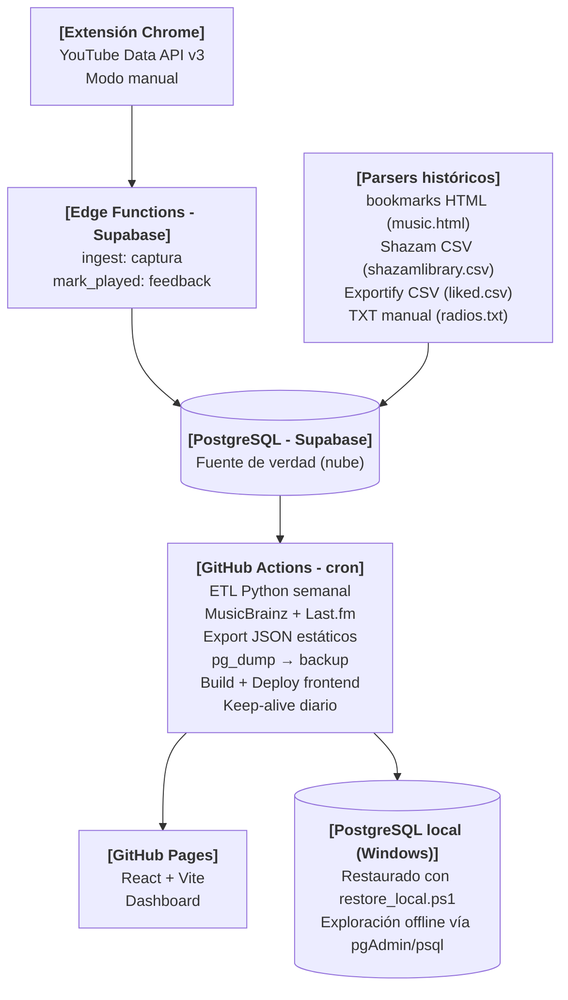

# GMC — Gestor Musical Centralizado

Sistema de captura para descubrimientos musicales al instante y volver a escucharlos cuando se quiera.

## El problema

Las canciones favoritas se acumulan en fuentes dispersas (YouTube, Shazam, Spotify, archivos manuales) y rara vez se vuelven a escuchar. GMC resuelve dos cosas: capturar un descubrimiento en el momento exacto en que sucede, y presentar el historial acumulado de forma que invite a redescubrirlo.

## Arquitectura



## Componentes

| Componente         | Tecnología                                                                                                                                                                                                | Rol                                                 |
| ------------------ | --------------------------------------------------------------------------------------------------------------------------------------------------------------------------------------------------------- | --------------------------------------------------- |
| Extensión          |       | Captura inmediata con nota opcional                 |
| Ingesta            |                                                                       | Proxy seguro hacia la BD                            |
| Base de datos      |                                                                         | Fuente de verdad en nube                            |
| Parsers históricos |                 | Ingesta de archivos acumulados                      |
| ETL semanal        |                                                                              | Enriquecimiento + export + backup                   |
| Enriquecimiento    |                                                                                | Metadatos canónicos + géneros                       |
| Frontend           |                            | Dashboard estático + fetches live                   |
| Backup local       |    | Restauración offline desde artefacto GitHub Actions |

## Disponibilidad

| Función                    | Disponibilidad                                                      |
| -------------------------- | ------------------------------------------------------------------- |
| Captura de descubrimientos | Siempre (extensión + Supabase; keep-alive diario evita hibernación) |
| Dashboard                  | Siempre (GitHub Pages, archivos estáticos)                          |
| Datos enriquecidos         | Actualizados cada domingo 02:00 AM UTC                              |
| Feedback "Escuchada"       | Siempre (Edge Function `mark_played` + Supabase)                    |
| Backup local               | Sincronizado semanalmente vía pg_dump; restaurable con un comando   |

## Estructura del repositorio

```bash
CentralizedMusicManagementSystem/
├── docs/
│   ├── PRODUCT.md              # Visión, flujos y requisitos
│   └── SPEC.md                 # Arquitectura, esquema, backlog técnico
├── extension/                  # Chrome Extension (Manifest V3)
├── supabase/
│   ├── schema.sql
│   └── functions/
│       ├── ingest/             # Edge Function: captura (Deno)
│       └── mark_played/        # Edge Function: feedback de escucha (Deno)
├── etl/
│   ├── parsers/                # bookmarks, shazam, exportify, txt
│   ├── enrichment/             # MusicBrainz + Last.fm + utils.py
│   └── export/                 # JSON estáticos para el frontend
├── frontend/                   # React + Vite → GitHub Pages
│   └── public/data/            # JSON generados por el ETL
├── backup/
│   └── restore_local.ps1       # Restaura pg_dump en PostgreSQL local (Windows)
└── .github/workflows/
    ├── weekly.yml              # ETL + export + backup + deploy
    └── keepalive.yml           # Ping diario a Supabase
```

## Variables de entorno

```env
# Supabase
SUPABASE_URL=
SUPABASE_SERVICE_ROLE_KEY=    # Solo servidor (GitHub Actions, Edge Functions)
SUPABASE_ANON_KEY=            # Frontend (público, protegido por RLS)
SUPABASE_DB_URL=              # Conexión directa a PostgreSQL (solo GitHub Actions, pg_dump)

# APIs externas
YOUTUBE_API_KEY=              # Restringida al Extension ID en Google Cloud Console
LASTFM_API_KEY=

# Seguridad ingesta
GMC_INGEST_SECRET=            # Shared secret entre extensión y Edge Function ingest
```

## Estado del proyecto

| Fase | Épica                                          | Estado      |
| ---- | ---------------------------------------------- | ----------- |
| 1    | Supabase: esquema + Edge Functions             | ▣ Pendiente |
| 2    | Parsers históricos                             | ▣ Pendiente |
| 3    | Extensión Chrome                               | ▣ Pendiente |
| 4    | ETL semanal: enriquecimiento + export + backup | ▣ Pendiente |
| 5    | Frontend dashboard                             | ▣ Pendiente |

## Licencia

MIT
