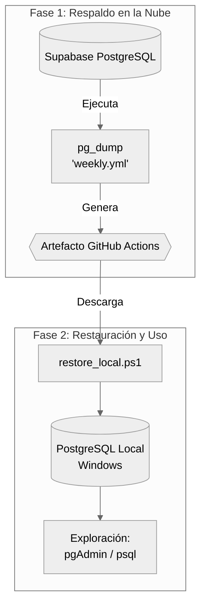

# backup/

Scripts para la restauración offline del historial musical desde el artefacto generado semanalmente por GitHub Actions. Diseñado para integrarse en el flujo de ETL local sin intervención manual.

## Cómo funciona

El proceso de los domingos ejecuta un `pg_dump` de la base de datos Supabase en la nube y lo almacena como artefacto de GitHub Actions con una retención de 90 días. El script `restore_local.ps1` automatiza la descarga de este artefacto y su volcado en el PostgreSQL local (entorno Windows), permitiendo la exploración de los datos unificados mediante pgAdmin o psql.



## Prerrequisitos

| Herramienta  | Verificación           | Notas                                    |
| ------------ | ---------------------- | ---------------------------------------- |
| `gh` CLI     | `gh --version`         | Autenticado con permisos `actions:read`  |
| `pg_restore` | `pg_restore --version` | Incluido en la instalación de PostgreSQL |
| PostgreSQL   | Servicio local activo  | Versión 14+                              |

### 1. Autenticar GitHub CLI

```powershell
gh auth login
gh auth status   # verificar conexión
```

### 2. Configurar Autenticación de PostgreSQL (Recomendado)

Para que el script se ejecute de forma completamente automatizada (sin pedir contraseña ni exponer credenciales), configura el archivo local `.pgpass` de Windows. Esto solo debe hacerse una vez:

```powershell
# Crear el directorio si no existe
New-Item -ItemType Directory -Force -Path "$env:APPDATA\postgresql"

# Crear el archivo con tus credenciales
# Formato: hostname:port:database:username:password
Add-Content -Path "$env:APPDATA\postgresql\pgpass.conf" -Value "localhost:5432:*:postgres:TU_CONTRASEÑA_AQUI"
```

## Primera vez: crear la base de datos local

Antes de la primera restauración, es necesario inicializar la base de datos receptora:

```powershell
psql -U postgres -c "CREATE DATABASE gmc;"
```

_Nota: Solo es necesario ejecutar esto una vez. Las restauraciones posteriores utilizan internamente los flags `--clean --if-exists` para recrear los esquemas y datos sin necesidad de eliminar la base de datos completa._

## Uso

El script está diseñado para ejecutarse silenciosamente si `.pgpass` está configurado. Antes del primer uso, asegúrate de editar el valor por defecto de `$Repo` dentro de `restore_local.ps1` o pasarlo como argumento.

```powershell
# 1. Ejecución estándar (usa los valores por defecto del script):
.\backup\restore_local.ps1

# 2. Ejecución con parámetros explícitos:
.\backup\restore_local.ps1 -DbName gmc -DbUser postgres -Repo GeraldAC/gmc

# 3. Ejecución temporal sin .pgpass (pedirá contraseña de forma segura):
.\backup\restore_local.ps1 -DbPassword (Read-Host "Password" -AsSecureString)
```

## Cómo configurar `.pgpass` en Windows (Solo se hace una vez)

Para aprovechar la automatización al máximo y ejecutar el script simplemente con `.\restore_local.ps1`, configura tu sistema así:

1. Abre tu terminal de PowerShell y crea la carpeta si no existe:

   ```powershell
   New-Item -ItemType Directory -Force -Path "$env:APPDATA\postgresql"
   ```

2. Crea el archivo `pgpass.conf` con tus credenciales:

   ```powershell
   # Formato: hostname:port:database:username:password
   # Usar "*" en la base de datos permite que la contraseña sirva para cualquier BD de esa instancia local.
   Add-Content -Path "$env:APPDATA\postgresql\pgpass.conf" -Value "localhost:5432:*:postgres:TU_CONTRASEÑA"
   ```

Una vez creado este archivo, `pg_restore` (y cualquier otra herramienta de PostgreSQL como `psql`) lo leerá automáticamente. El script detectará esto, ignorará cualquier parámetro manual de contraseña y procederá con la ingesta de datos de forma silenciosa y segura.

## Exploración offline

Una vez completada la restauración, los datos consolidados estarán listos para su análisis local:

```powershell
# Acceso por terminal (psql)
psql -U postgres -d gmc

# pgAdmin:
# Conectar al servidor local (localhost:5432) → expandir base de datos "gmc"
```
